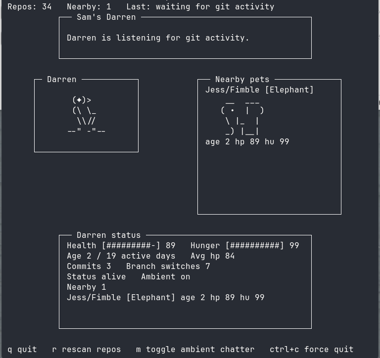

# Pet-term

A tamagotchi-like pet that lives in your terminal and eats git branch changes and commits.

Pets on the local network are visible to other users.



# Config

## Initial setup

Install dependencies with Node.js 20 or newer:

```sh
npm install
```

Run pet-term against a directory that contains one or more git repositories:

```sh
npm run dev -- /path/to/projects
```

You can set the initial pet identity with CLI flags:

```sh
npm run dev -- /path/to/projects --owner-name Catherine --pet-name Moss --pet-type crow
```

Or add a `.env` file in the target root directory or the directory where you launch pet-term (there is an example [.env](.env.example) file):

```sh
PET_TERM_OWNER_NAME=Jim
PET_TERM_PET_NAME=Splat
PET_TERM_PET_TYPE=blob
```

Supported pet types are:
- `crow`
- `blob`
- `wolf`
- `elephant`

CLI flags override shell environment variables, and shell environment variables override values from `.env`.

# Licence

MIT, see [LICENSE](LICENSE.md) for details.

Some pet ascii art is licensed under MIT License from [petsonality](https://github.com/nanami-he/petsonality/tree/main)

# Acknowledgements

Inspiration from [terminal pet](https://github.com/apoorvgarg31/terminal-pet) and some ascii from [petsonality](https://github.com/nanami-he/petsonality/tree/main)
